# 2要素認証の実装例

## 動作確認

まず起動する。

```
mvn jetty:run
```

それから http://localhost:8080 を開く。

用意しているユーザーは次の通り。

|ユーザー|パスワード|2要素認証の状態|
|---|---|---|
|`foo`|`secret`|ON|
|`bar`|`secret`|OFF|

ユーザーfooは2要素認証がONなのでログインする時にワンタイムパスワードが要求される。

ワンタイムパスワードは次のメインクラスを実行すると1秒毎に標準出力へ出力されるので、それをコピペするとよい。

- `src/main/java/OneTimePassword.java`

## アーキテクチャ

パスワード認証も2要素認証も基本的には次の2つのサーブレットフィルターで構成されている。

- 画面を出して認証を行うサーブレットフィルター
- 認証済みかどうか確認するサーブレットフィルター

これらのサーブレットフィルターは次のクラスで設定されている。
適用順序を制御したいためアノテーションではなく`ServletContext.addFilter`で設定している。

- `com.example.config.FilterConfig`

認証のフローはこんな感じ。


